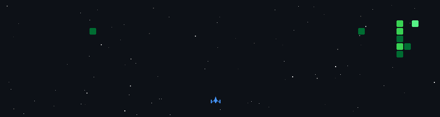

<table>
<tr>
<td width="65%" valign="top">

# Muhammad Ahsan Khan

**Software Engineering Student · AI Apps · Cross-Platform Software · Islamabad, Pakistan**

</td>
<td width="35%" align="center" valign="top">

</td>
</tr>
</table>

---

<table>
<tr>
<td>

## Who I am

I'm a Software Engineering student at Air University, Islamabad (Class of 2028), focused on building AI-powered applications, cross-platform software, and low-level systems simulations. I've built a real-time AI chatbot using Flask and the Gemini API with NLP-based matching, a cross-platform 2D platformer in C++ with SFML, and a CPU cache simulator written in raw x86 Assembly implementing FIFO and LRU replacement policies.

I care about understanding systems at every layer, from high-level AI logic down to how memory and instructions actually move through a CPU.

---

## Tech stack

---

## GitHub stats

---

## Get in touch

If you're working on an AI project, a systems programming problem, or you're hiring for a software engineering internship, I'd like to hear about it.

📧 <mahsankhan5020@gmail.com> 💼 [linkedin.com/in/muhammadahsankhan5020](https://linkedin.com/in/muhammadahsankhan5020) 💻 [github.com/Muhammad-Ahsan-Khan](https://github.com/Muhammad-Ahsan-Khan)

</td>
</tr>
</table>
